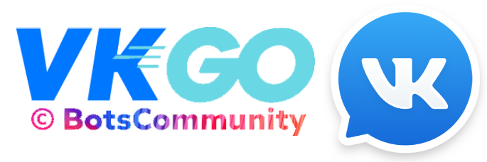

<p align="center">
	
</p>
<p align="center">
	
	
	
	
</p>

# Description
**VKGO** — is a flexible and fast SDK by BotsCommunity Team for VK API. Allows you to build high performance bots in comfort

| 🌐 WebSite | 🗂 Samples | 🇯🇵 Localization |
| --- | --- | --- |

---

# 🚀 Features
* 199 methods
* LongPoll User
* Group LongPoll
* Webhooks

# 🍬 Contents
*   ⚙️ [Get Started](#get-started)
*   📚 [Usage](#usage)

# ⚙️ Get Started
Use the Get command to install a package into your local development environment
```shell
go get github.com/botscommunity/vkgo
```

## 📚 Usage
See `SAMPLES` for more presets
<details>
<summary><b>Group LongPoll</b></summary>

```go
// main.go
package main

import (
	"os"

	"github.com/botscommunity/vkgo/API"
	"github.com/botscommunity/vkgo/scenes"
	"github.com/botscommunity/vkgo/longpoll"
)

func main() {
	bot := API.Create()
	bot.Config("token", os.Getenv("TOKEN"))
	bot.Config("version", 5.131)

	updates := scenes.Create()
	updates.Add("message", func(bot *API.Options, update updates.Updates) {})

	longpoll.Create(bot).EndlessListen(updates)
}
```
</details>
<details>
<summary><b>LongPoll User</b></summary>

```go
// main.go
package main

import (
	"os"

	"github.com/botscommunity/vkgo/API"
	"github.com/botscommunity/vkgo/scenes"
	"github.com/botscommunity/vkgo/user"
)

func main() {
	bot := API.Create()
	bot.Config("token", os.Getenv("TOKEN"))
	bot.Config("version", 5.131)

	updates := scenes.Create()
	updates.Add("message", func(bot *API.Options, update updates.Updates) {})

	user.Create(bot).EndlessListen(updates)
}
```
</details>

<details>
<summary><b>WebHook</b></summary>

```go
// main.go
package main

import (
	"os"

	"github.com/gofiber/fiber/v2"
	"github.com/botscommunity/vkgo/API"
	"github.com/botscommunity/vkgo/scenes"
	"github.com/botscommunity/vkgo/webhook"
)

func main() {
	tokens := *map[webhook.GroupID]webhook.Token{}

	updates := scenes.Create()
	updates.Add("message", func(bot *API.Options, update updates.Updates) {})

	webhook.Create(tokens, updates)

	app := fiber.New()
	app.Post("vkontakte/:confirmation", webhook.Fiber)
	app.Listen(":3000")
}
```
</details>

Event Handling:

```go
package events

func Message(bot *API.Options, update *updates.Update) {
	message := update.Object.Message
	fmt.Printf("ChatID: %d | Message: %s\n", message.ChatID, message.Text)
}
```

---

## 🎯 Benchmarks
[💡 Author of the Idea](https://github.com/elias506/vk-sdk#benchmarks)

## 🌏 Roadmap


[💡 Author of the Idea](https://github.com/azzzak/vkapi#%D1%80%D0%B5%D0%B0%D0%BB%D0%B8%D0%B7%D0%BE%D0%B2%D0%B0%D0%BD%D0%BD%D1%8B%D0%B5-%D0%BC%D0%B5%D1%82%D0%BE%D0%B4%D1%8B)
| Section |  | Methods |
| :---: | :---: | :---: |
| Account | ✗ | 0/37 |
| AppWidgets |  | 0/2 |
| Apps |  | 0/9 |
| Auth | ✓ | 0/14 |
| Board |  | 0/x |
| Database|  | 0/4 |
| Docs |  | 0/6 |
| Fave |  | 0/31 |
| Friends |  | 0/15 |
| Gifts |  | 0/5 |
| Groups |  | 0/26 |
| LeadForms |  | 0/x |
| Likes |  | 0/3 |
| Market |  | 0/26 |
| Messages |  | 0/40 |

## 🦸 Contributors

<table>
	<tbody>
		<tr>
			<td align="center">
				<a href="https://kentcdodds.com">
					
					<br />
					<sub>
					<b>
					Almaz Kaspersky
					</b>
					</sub>
				</a>
				<br />
				<a href="https://github.com/all-contributors/all-contributors/pulls?q=is%3Apr+reviewed-by%3Akentcdodds" title="Reviewed Pull Requests">🐛</a>
				<a href="#talk-kentcdodds" title="Talks">🐙</a>
			</td>
		</tr>
	</tbody>
</table>

# 📝 License
Distributed under the MIT License. See `LICENSE.txt` for more information.

# 📪 Contacts


